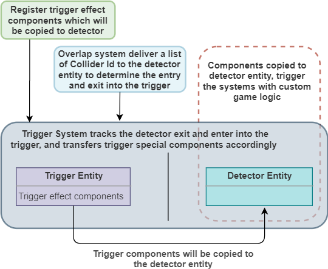
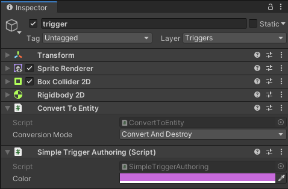
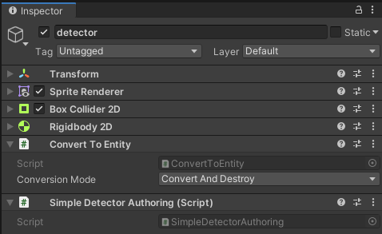

# Unity-DOTS-TriggerSystem


## Core idea



## How to use

**See the examples in the project**

### Step 1

Create an effect component

```csharp
public struct SimpleTriggerEffect : IComponentData
{
	public Color Color;
	public bool  Used;
}
```

### Step 2

Register the component in the system (See AddTriggerEffectsSystem ComponentSystem)

```csharp
	_triggerDetectorSystem.Conversion.Add(typeof(SimpleTriggerEffect), EcsUtils.CopyComponent<SimpleTriggerEffect>);
```

### Step 3

Create a prefab with conversion for the trigger

```csharp
public class SimpleTriggerAuthoring : MonoBehaviour, IConvertGameObjectToEntity
{
	public Color Color;

	public void Convert(Entity entity, EntityManager dstManager, GameObjectConversionSystem conversionSystem)
	{
		conversionSystem.AddHybridComponent(GetComponent<SpriteRenderer>());
		conversionSystem.AddHybridComponent(GetComponent<Transform>());
		conversionSystem.AddHybridComponent(GetComponent<Rigidbody2D>());
		conversionSystem.AddHybridComponent(GetComponent<BoxCollider2D>());

		dstManager.AddComponent<TriggerComponent>(entity);
		dstManager.AddComponent<Enabled>(entity);
		dstManager.AddComponent<SimpleTriggerEffect>(entity);

		dstManager.SetComponentData(entity, new SimpleTriggerEffect
		{
			Color = Color
		});
	}
}
```



### Step 4

Create a prefab with conversion for the detector

```csharp
public class SimpleDetectorAuthoring : MonoBehaviour, IConvertGameObjectToEntity
{
	public void Convert(Entity entity, EntityManager dstManager, GameObjectConversionSystem conversionSystem)
	{
		conversionSystem.AddHybridComponent(GetComponent<SpriteRenderer>());
		conversionSystem.AddHybridComponent(GetComponent<Transform>());
		conversionSystem.AddHybridComponent(GetComponent<Rigidbody2D>());
		conversionSystem.AddHybridComponent(GetComponent<BoxCollider2D>());

		dstManager.AddComponent<DetectorComponent>(entity);
		dstManager.AddComponent<InputComponent>(entity);
		dstManager.AddComponent<SimpleDetectorTag>(entity);
		dstManager.AddComponent<Enabled>(entity);
		dstManager.AddComponent<CopyTransformFromGameObject>(entity);
	}
}
```



### Step 5

Create system with custom game logic

```csharp
public class SimpleTriggerEffectSystem : SystemBase
{
	protected override void OnUpdate()
	{
		Entities.WithoutBurst().WithAll<DetectorComponent>().ForEach(
			(Entity e, int entityInQueryIndex, ref SimpleTriggerEffect triggerEffect, in SpriteRenderer spriteRenderer) =>
			{
				if (!triggerEffect.Used)
				{
					triggerEffect.Used   = true;
					spriteRenderer.color = triggerEffect.Color;
				}
			}).Run();
	}
}
```


## Used assets

https://assetstore.unity.com/packages/2d/characters/tiny-rpg-forest-114685
https://www.1001fonts.com/arcadeclassic-font.html
